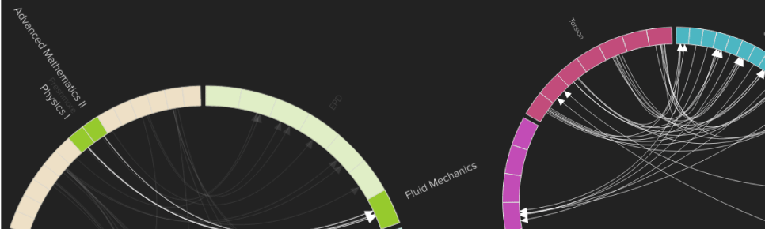
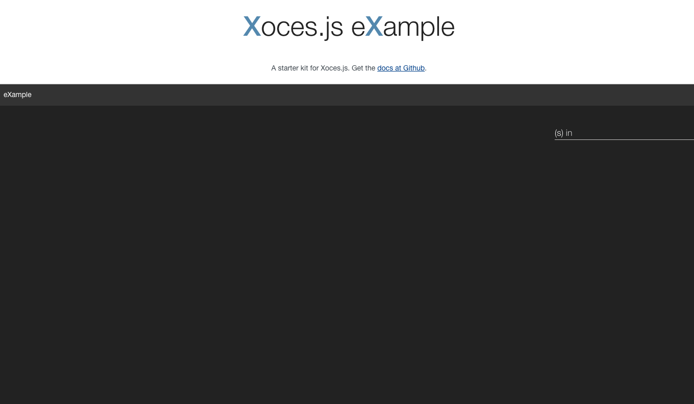

# Xoces.js
Interactive chord-diagram visualization library to visualize learning outcomes. Built with d3.js + AngularJS + webpack. 

Xoces.js was created by Luwen Huang and [Karen E. Willcox](http://kiwi.mit.edu) as part of the [Xoces project](https://xoces.mit.edu). 


## What is Xoces.js for
Xoces.js is a JavaScript library that makes interactive chord visualizations out of "mappable" data. ([What is educational mapping?](http://kiwi.mit.edu/education.php)) Xoces.js was originally created to visualize the learning outcomes of MIT, but has since been adopted to visualize the learning outcome data of other institutions, including the Singapore University of Technology & Design and Arapahoe Community College. Xoces.js is front-end only and doesn't supply any data - you'll need to provide the RESTful service of your choice to feed data into Xoces.js. 

Use Xoces.js when you have mappable data, and you want a multiple-level chord visualization to show the connections in your data.

## Installing

Download the repository:

```
git clone https://github.com/luwen-huang/xoces.git
cd xoces
```

The Xoces.js codebase is composed of CommonJS modules and uses webpack to bundle and serve our files. You'll need to have node and npm already installed. Then, to set up your environment: 

```
npm install
```

Node-sass and sass-loader may spit out scary warnings. This should be fine. Then, 

```
npm start
```

In your browser, open up a new tab at:
```
http://localhost:8080
```

You should see a screen like this:




## Hello World
To make sure your setup is watching your changes, let's try adding a snippet to our title:

In xplore.html, pick a spot to add:
```
<h1>Hello Xoces</h1>
```

The browser page should automatically refresh and reflect your shiny new addition. Congratulations! You're ready to go.


## Getting Started
This assumes you already have a Backstage service set up with API endpoints you can plug into the code. The files you'll need to modify are:

```
* model/
  -- xplore.controller.js

* xplore/
  -- proxy.js
  -- collectionSearch.js
```

### Modifying xplore.controller.js 
xplore.controller.js is instantiated on startup and immediately tries to load the data set of your choice. You need to specify the name of your data set:

```
$scope.chosenData.name = 'eXample';
```

### Modifying proxy.js
proxy.js is responsible for interfacing with your RESTful service, so you'll need to configure your API's endpoints. We do that here in this object:

```
// make sure the key in this object matches with 
// the name of the data set you had specified in xplore.controller.js
var endpoints = {
	'eXample': {
		objective: 'http://myAPIEndpoint/objectives',
		relationship: 'http://myAPIEndpoint/relationships'
	},
};
```
Xoces.js expects these endpoints to return a JSON of all the objectives and a JSON of all the relationships you want to be visualized. 


### Modifying collectionSearch.js
You need to write the code that tells Xoces what are parents and children of entities. 

Why are these functions in objects key'ed by the name of your data set? Because in order for Xoces to work with more than one data set, you need to tell it what *things* are the children of what other things.

```
var getChildrenFns = {
	'eXample': function(argModel) {
		switch (argModel.modelType) {

		// at the top level of this eXample data set, the first model type is COURSE
		case ModelParams.ROOT:
			return courses;
			break;

		// the children of COURSEs are SUBJECTs
		case ModelParams.COURSE:
			return subjects.filter( function(model) {
				return model.courses.indexOf(argModel) > -1;
			});
			break;

		// the children of SUBJECTs are MODULEs
		case ModelParams.SUBJECT:
			return modules.filter( function(model) {
				return model.subjects.indexOf(argModel) > -1;
			});
			break;

		// the children of MODULEs are OUTCOMEs
		case ModelParams.MODULE:
			return outcomes.filter( function(model) {
				return model.modules.indexOf(argModel) > -1;
			});
			break;

		// the children of the lowest level model are always defined to be itself, wrapped in an array. Very existential. 
		case ModelParams.OUTCOME:
			return [argModel];
			break;
		default:
			return [argModel];
			break;
		}
	},
};
```

## Dependencies
Xoces.js requires these open-source libraries (thanks all!): jQuery, lodash, angular, angular-ui-router, d3.js, harthur-color. You can find them already built in the `vendor/` directory. 

Refactoring Xoces.js to be non-dependent on AngularJS and jQuery is entirely possible. Those may be milestones for the future.

## Papers
* [Mapping Outcomes in an Undergraduate Aerospace Engineering Program](https://xoces.mit.edu/papers/Linking-learning-outcomes-Willcox.pdf)

## License

This content is released under the (http://opensource.org/licenses/MIT) MIT License.
